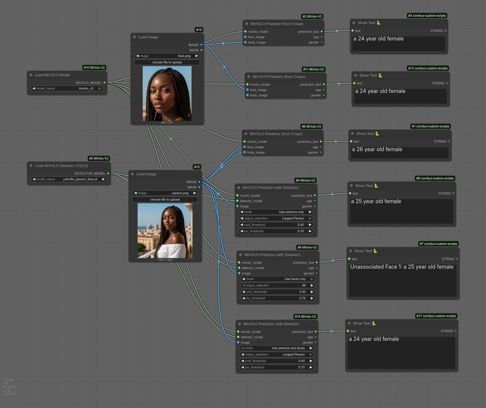

[简体中文](README_zh.md)

# ComfyUI MiVolo V2 Node


[](https://creativecommons.org/licenses/by-sa/4.0/)
[](https://huggingface.co/iitolstykh/mivolo_v2)

Use the advanced **MiVolo V2** model directly in ComfyUI for high-precision age and gender prediction!

This project is a ComfyUI wrapper node for the `iitolstykh/mivolo_v2` model. MiVolo is a Transformer-based, multi-input (face and body) model that provides reliable age and gender estimations.

## 🌟 Core Features

* **Age Estimation:** Receives an image (containing a face or body) and outputs the predicted age as a string.
* **Gender Estimation:** Outputs the predicted gender (e.g., Male/Female) as a string.
* **Multi-Person Support:** Automatically processes face and body crops to improve accuracy (based on the original model's capabilities).

## 🖼️ Nodes and Workflow Examples

Example Workflow:



## 🚀 How to Install

### 1. (Recommended) Use ComfyUI Manager
1.  Open ComfyUI Manager.
2.  Click "Install Custom Nodes".
3.  Search for `ComfyUI-MiVolo-V2` and install it.
4.  Restart ComfyUI.

### 2. (Manual) Git Clone
1.  Open a terminal and navigate to your ComfyUI `custom_nodes` directory:
    ```bash
    cd ComfyUI/custom_nodes/
    ```
2.  Clone this repository:
    ```bash
    git clone [https://github.com/](https://github.com/)[YourUsername]/ComfyUI-MiVolo-V2.git
    ```
    *(Please replace `[YourUsername]` with your actual GitHub username)*
3.  Install the dependencies:
    ```bash
    pip install -r requirements.txt
    ```
4.  Restart ComfyUI.

## 📦 Model Installation

This custom node requires two types of models:
1.  **MiVOLO Age/Gender Model** (for prediction)
2.  **YOLO Detector Model** (for finding faces and bodies, optional)

This project supports both automatic downloading and manual placement of models.

### 1. MiVOLO Age/Gender Model (MiVOLOLoader)

This is the main prediction model.

* **Model Name:** `iitolstykh/mivolo_v2`
* **Storage Path:** `ComfyUI/models/mivolo/`

#### Method A: Automatic Download (Recommended)
1.  The code is configured to handle this automatically.
2.  In ComfyUI, add the **"Load MiVOLO Model"** node.
3.  In the `model_name` field, keep the default **`"iitolstykh/mivolo_v2"`** selected.
4.  The first time you run a workflow, the `transformers` library will automatically download this model from Hugging Face and cache it on your system.

#### Method B: Manual Download
If you want to manage models manually or use them in an offline environment:
1.  Visit the Hugging Face repo: [https://huggingface.co/iitolstykh/mivolo_v2](https://huggingface.co/iitolstykh/mivolo_v2)
2.  Download or `git clone` the entire repository.
3.  Ensure all model files (like `config.json`, `pytorch_model.bin`, etc.) are located in a folder named after the model.
4.  Place this folder inside the `mivolo` directory in your ComfyUI `models` directory.

The final path structure should be:
```
ComfyUI/
└── models/
    └── mivolo/
        └── iitolstykh/mivolo_v2/
            ├── config.json
            ├── configuration_mivolo.py
            ├── modeling_mivolo.py
            ├── pytorch_model.bin
            └── ... (and all other files)
```
Once done, the "Load MiVOLO Model" node will automatically detect it in the dropdown list.

### 2. YOLO Detector Model (MiVOLODetectorLoader)

This is a `.pt` file used to detect people and faces in an image.

* **Model Name:** `yolov8x_person_face.pt`
* **Hugging Face Repo:** `iitolstykh/demo_yolov8_detector`
* **Storage Path:** `ComfyUI/models/yolo/`

#### Method A: Automatic Download (Recommended)
1.  In ComfyUI, add the **"Load MiVOLO Detector (YOLO)"** node.
2.  Keep the default `model_name` selected: **`"iitolstykh/demo_yolov8_detector/yolov8x_person_face.pt"`**.
3.  The first time you run a workflow, the script will check the `ComfyUI/models/yolo/` folder.
4.  If the `yolov8x_person_face.pt` file is not found, the script will **automatically download it from Hugging Face** and place it in the correct `yolo` folder.

#### Method B: Manual Download
If you prefer to download it manually:
1.  Visit the Hugging Face repo: [https://huggingface.co/iitolstykh/demo_yolov8_detector/tree/main](https://huggingface.co/iitolstykh/demo_yolov8_detector/tree/main)
2.  Download the single file `yolov8x_person_face.pt`.
3.  Place this file in the `yolo` directory under your ComfyUI `models` directory. (Create the `yolo` folder if it doesn't exist).

The final path structure should be:

```
ComfyUI/
└── models/
    └── yolo/
        └── yolov8x_person_face.pt
```

Once done, the "Load MiVOLO Detector (YOLO)" node will be able to load the model immediately.

## 💡 Usage Tips

* For best results, ensure the input image is clear and the face/body is visible.
* Supports using pre-cropped faces as input, as well as automatic detection.
* Can be used to analyze AI-generated portraits or for conditional control based on age/gender.

## 📜 Acknowledgments and License

This project is **Adapted Material** based on `iitolstykh/mivolo_v2`.

* **Original Model:** [`iitolstykh/mivolo_v2` (Hugging Face)](https://huggingface.co/iitolstykh/mivolo_v2)
* **Original Papers:**
    * [MiVOLO: Multi-input Transformer for Age and Gender Estimation (2023)](https://arxiv.org/abs/2307.04616)
    * [Beyond Specialization: Assessing the Capabilities of MLLMs in Age and Gender Estimation (2024)](https://arxiv.org/abs/2403.02302)
* **Original License:** The original project uses a custom license based on CC BY-SA 4.0. See the original repository's [LICENSE](https://github.com/WildChlamydia/MiVOLO/tree/main/license) file for details.

In accordance with the original license's "ShareAlike" condition, **this ComfyUI node project is also open-sourced under the Creative Commons Attribution-ShareAlike 4.0 (CC BY-SA 4.0) license.**

This means you are free to use, modify, and distribute this project, provided you give appropriate attribution and share your adaptations under the same license.

## 🐞 Bug Reports

If you encounter any issues or have feature suggestions, please feel free to open an Issue on the "Issues" page!
